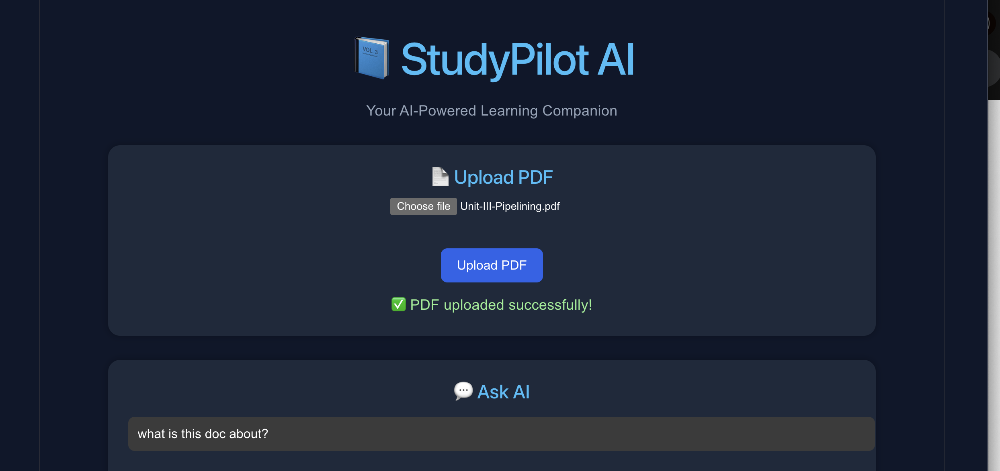
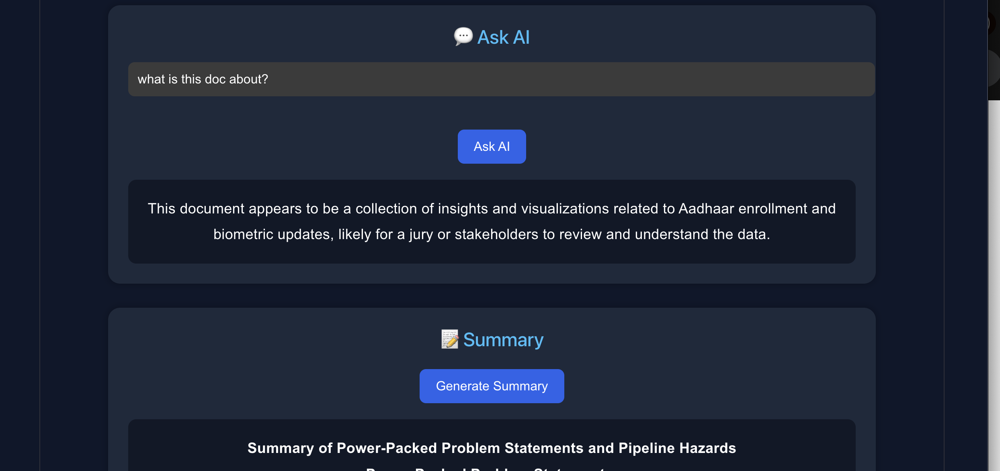
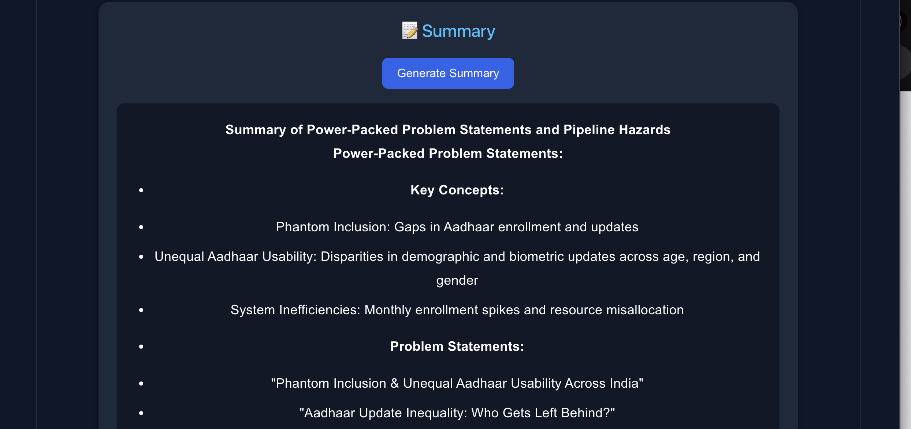
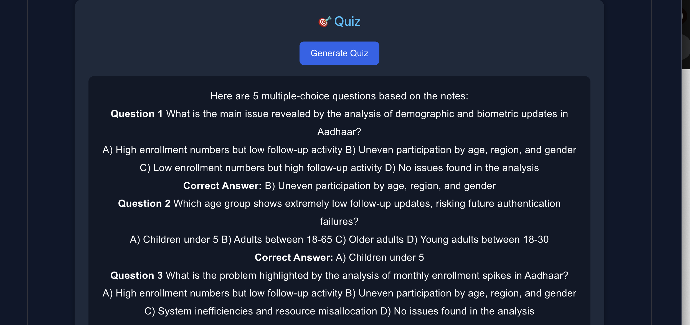

# 📘 StudyPilot AI

> **An AI-powered Study Assistant that enables students to upload PDF notes, ask questions, generate summaries, and create quizzes using Retrieval-Augmented Generation (RAG).**

---

# 📸 Application Screenshots

## 📄 Upload PDF



---

## 💬 Ask AI



---

## 📝 Generate Summary



---

## 🎯 Generate Quiz



---

# 📖 Overview

StudyPilot AI is an intelligent learning assistant that helps students study more efficiently using Artificial Intelligence and Retrieval-Augmented Generation (RAG).

Instead of manually searching through lengthy notes, students can upload a PDF and interact with it naturally. The application retrieves the most relevant information from the uploaded document and uses an LLM to answer questions, generate concise summaries, and create quizzes.

---

# ✨ Features

- 📄 Upload PDF Notes
- 💬 Ask questions from uploaded notes
- 📝 AI-generated study summaries
- 🎯 Automatic quiz generation
- 🔍 Semantic search using ChromaDB
- ⚡ Fast responses powered by Groq Llama 3.1
- 🤖 Retrieval-Augmented Generation (RAG)

---

# 🏗️ System Architecture

```text
                React Frontend
                       │
                 Axios API Calls
                       │
                FastAPI Backend
                       │
                 PDF Upload API
                       │
                PDF Text Extraction
                       │
                  Text Chunking
                       │
      Sentence Transformer Embeddings
                       │
                   ChromaDB
                       │
          Retrieve Relevant Chunks
                       │
             Groq Llama 3.1 API
                       │
       ┌──────────┬──────────┬──────────┐
       │          │          │
     Answer    Summary     Quiz
```

---

# 🛠️ Tech Stack

### Frontend

- React
- Vite
- Axios
- React Markdown
- CSS

### Backend

- FastAPI
- Python

### AI & Machine Learning

- Groq API
- Llama 3.1
- Sentence Transformers
- ChromaDB
- Retrieval-Augmented Generation (RAG)

---

# 📂 Project Structure

```text
StudyPilot-AI
│
├── backend
│   ├── api
│   │   ├── upload.py
│   │   ├── chat.py
│   │   ├── summary.py
│   │   └── quiz.py
│   │
│   ├── rag
│   │   ├── pdf_reader.py
│   │   ├── chunk.py
│   │   ├── embedding.py
│   │   ├── vector_store.py
│   │   ├── retriever.py
│   │   └── generator.py
│   │
│   ├── config.py
│   ├── main.py
│   └── requirements.txt
│
├── frontend
│   ├── src
│   ├── public
│   ├── package.json
│   └── vite.config.js
│
├── README.md
├── upload.png
├── ask.png
├── summary.png
├── quiz.png
└── .gitignore
```

---

# 🚀 Installation

## 1. Clone the Repository

```bash
git clone https://github.com/harshu-13/StudyPilot-AI.git
```

---

## 2. Backend Setup

```bash
cd backend

python -m venv venv

source venv/bin/activate

pip install -r requirements.txt

uvicorn main:app --reload
```

---

## 3. Frontend Setup

```bash
cd frontend

npm install

npm run dev
```

---

# 🔥 API Endpoints

| Method | Endpoint | Description |
|---------|----------|-------------|
| POST | `/upload` | Upload PDF notes |
| POST | `/chat` | Ask questions from uploaded notes |
| POST | `/summary` | Generate AI summary |
| POST | `/quiz` | Generate AI quiz |

---

# 🎯 How It Works

1. Upload a PDF containing study notes.
2. The backend extracts text from the PDF.
3. The extracted text is divided into smaller chunks.
4. Sentence Transformers generate embeddings for each chunk.
5. Embeddings are stored in ChromaDB.
6. When a question is asked, the system retrieves the most relevant chunks.
7. Groq Llama 3.1 generates an answer based only on the retrieved context.
8. The same context is used to generate summaries and quizzes.

---

# 🌟 Future Enhancements

- 🔐 User Authentication
- 📚 Support for Multiple PDFs
- 🎴 Flashcard Generation
- 🎤 Voice-based Study Assistant
- 📈 Learning Progress Dashboard
- ☁️ Cloud Deployment
- 📱 Mobile Application

---

# 👩‍💻 Author

**Harsha Vardhini Selva Ganesh**

Third Year Computer Science Engineering Student

---

# 🙌 Acknowledgements

This project was built using:

- FastAPI
- React
- ChromaDB
- Sentence Transformers
- Groq API
- Vite

---

## ⭐ If you found this project useful, consider giving it a star on GitHub!